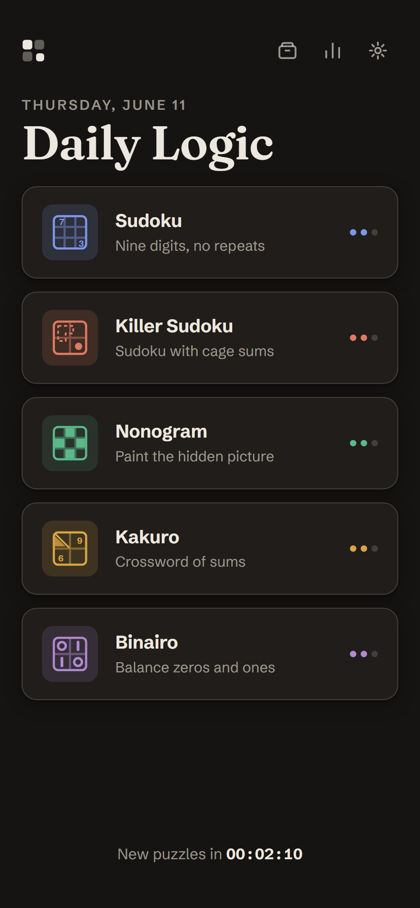

# Daily Logic

🧩 **Play now → <https://aastikrajan.github.io/daily-puzzles/>**

Five fresh logic puzzles every day — **Sudoku, Killer Sudoku, Nonogram (Picross), Kakuro and
Binairo** — identical for every player worldwide, generated deterministically from the UTC
date. Wordle-style retention: streaks, stats, and spoiler-free emoji share cards. Installable
PWA with full offline play; architected for a Capacitor iOS wrap.



## Quick start

```powershell
npm ci
npm run dev        # vite dev server → http://localhost:5173
```

## Commands

| Command | What it does |
|---|---|
| `npm test` | Engine quick suite (42 puzzles/type, all invariants) + web unit tests |
| `npm run test:full` | Gate suite: 200+ puzzles/type, uniqueness + speed proofs |
| `npm run e2e` | Playwright: full playthrough of all five puzzles, share/streak/offline tests, screenshot gallery |
| `npm run build` | Typecheck + production PWA build → `apps/web/dist` |
| `npm run preview` | Serve the production build |

## Architecture

```
packages/engine   pure TypeScript, zero deps — generators/solvers/graders for all
                  five puzzle types + seeded daily system (sfc32/FNV-1a, no Math.random).
                  Every generated puzzle is proven to have exactly one solution.
apps/web          React + Vite + zustand PWA. SVG boards, localStorage persistence,
                  Workbox offline precache, beforeinstallprompt install flow.
```

Key documents: [PLAN.md](PLAN.md) · [DECISIONS.md](DECISIONS.md) · [RESEARCH.md](RESEARCH.md) ·
[PORTING.md](PORTING.md) (iOS wrap) · [DEPLOY.md](DEPLOY.md) (free hosting) ·
[CHANGELOG.md](CHANGELOG.md) · screenshot gallery in [artifacts/screens](artifacts/screens).

## How uniqueness is guaranteed

- **Sudoku** — clue removal only while a counting solver (bitmask + MRV) confirms exactly one solution; difficulty graded by human technique tier.
- **Nonogram** — only patterns a pure line-solver completes are accepted: every deduction is forced, so the solution is unique *and* reachable with logic alone.
- **Kakuro / Killer** — counting solvers with magic-block sum pruning; when a random instance is ambiguous, a minimal set of revealed digits pins it to uniqueness (reveal-repair).
- **Binairo** — holes are dug only while the rule-based solver still finishes.

Every property is enforced by tests (`packages/engine/test`), including determinism
(same date ⇒ byte-identical puzzle) and a no-`Math.random` source guard.
